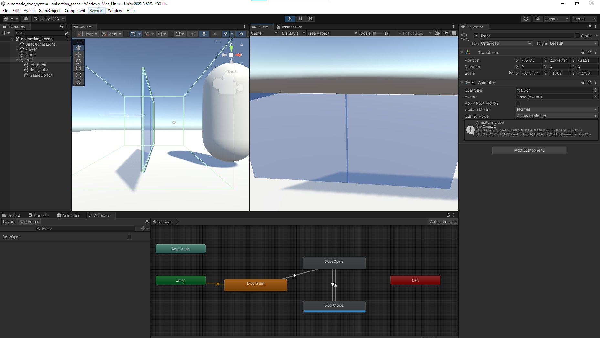
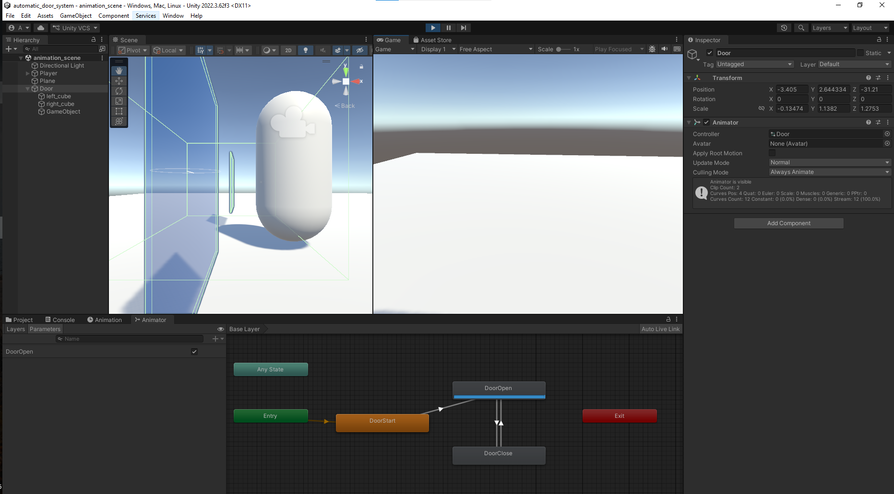

# Automatic Door System (Unity)

This is a simple Unity project demonstrating an automatic door system.

The door is simulated using two cube objects with transparent material. The opening and closing motion is created using Unity’s Animator with manually defined keyframes(start and end).

A script is used to detect player interaction and trigger the animation when the player enters or exits the door area.

---

## Setup

* Unity Version: 2022.3
* Template: 3D (Core)
* Render Pipeline: Built-in

---

## How to Run

1. Open the project in Unity Hub
2. Open the scene from `Assets/Scenes/`
3. Click **Play**
4. Move the player toward the door to see it open and close

---

## Configuration

* Door is created using two cube objects
* Transparent material is applied
* Animation is created manually using keyframes in Animator
* A trigger collider detects the player
* Script triggers the Animator parameters (open/close)

---

## reference 
https://www.youtube.com/watch?v=cNrKc_tT7XE

## Screenshot added.

