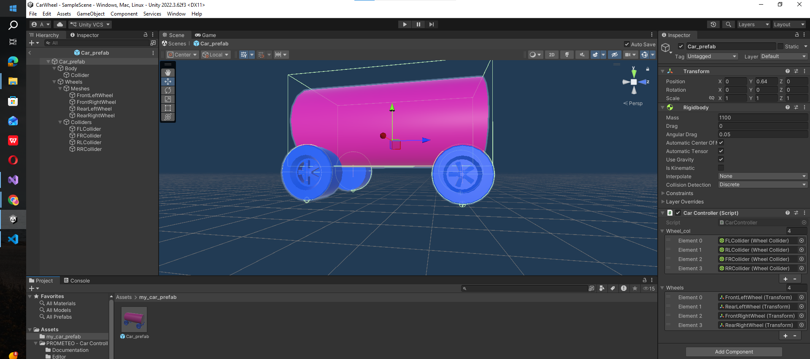
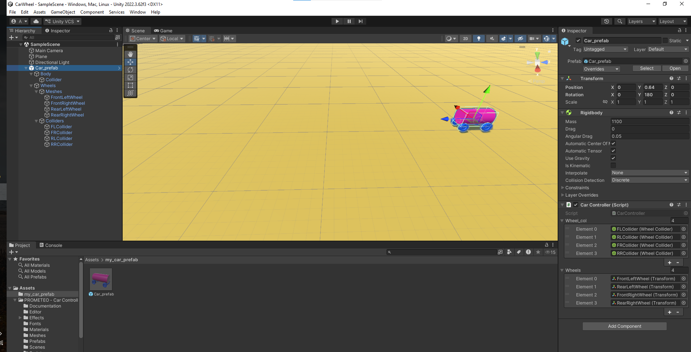
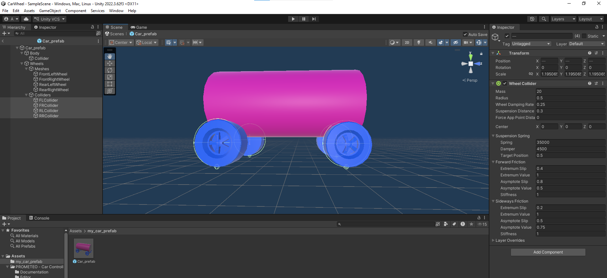
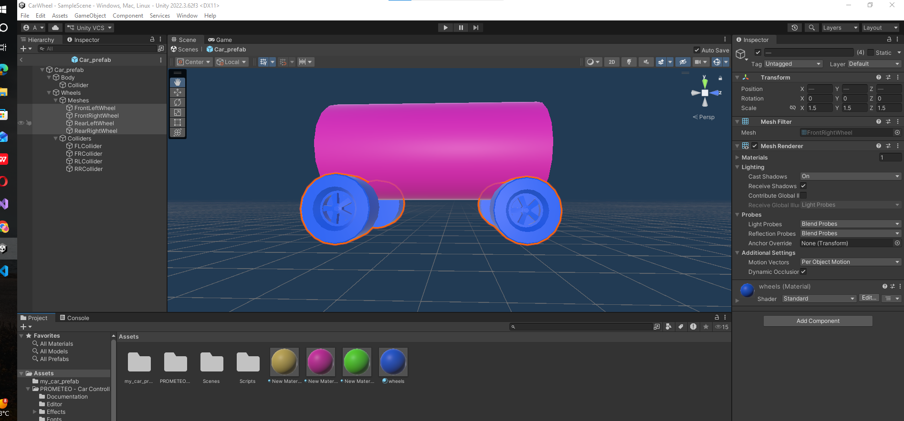
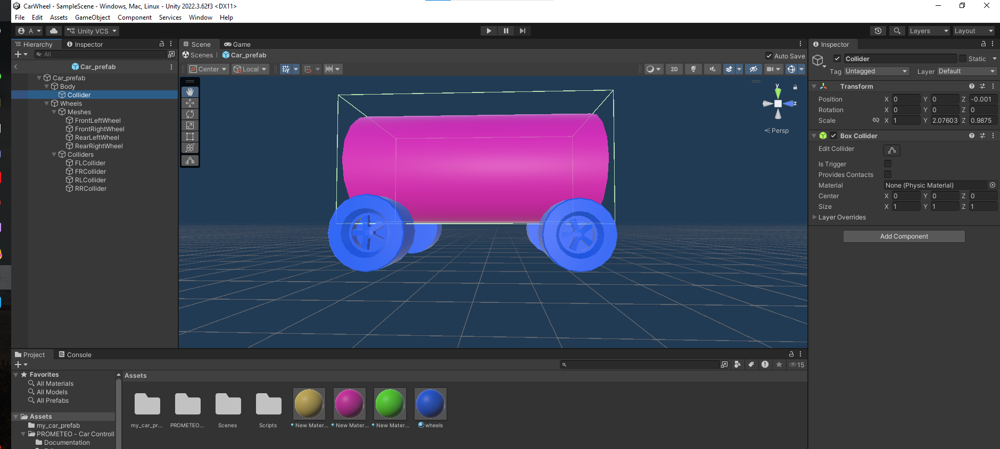
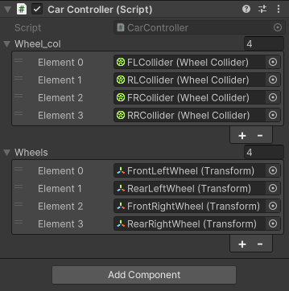
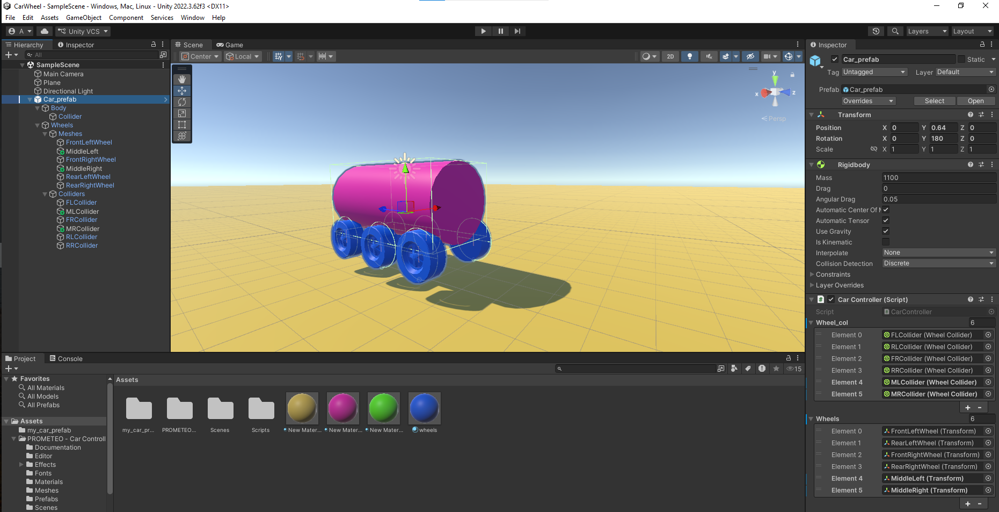

# Wheel Collider in unity for car movement

# Code reference 
https://vionixstudio.com/2022/10/13/unity-car-controller-using-wheel-collider-physics/

# documentation
https://docs.unity3d.com/2022.3/Documentation/ScriptReference/WheelCollider.html

# Video Reference
https://www.youtube.com/watch?v=Yyx_rkBNeao

# code
```
using UnityEngine;

public class CarController : MonoBehaviour
{
    public WheelCollider[] wheel_col;
    public Transform[] wheels;
    float torque = 200; //more speed
    float angle = 45;

    void FixedUpdate()
    {
        for (int i = 0; i < wheel_col.Length; i++)
        {
            // Forward and backward movement
            wheel_col[i].motorTorque = Input.GetAxis("Vertical") * torque;

            // Steering for front wheels
            if (i == 0 || i == 2) // We will set the steering angle and motor torque only to the front wheels. i.e at index 0 and 2 (front wheels)
            {
                wheel_col[i].steerAngle = Input.GetAxis("Horizontal") * angle;
            }
            // Update wheel mesh position and rotation
            var pos = transform.position;
            var rot = transform.rotation;
            wheel_col[i].GetWorldPose(out pos, out rot);
            wheels[i].position = pos;
            wheels[i].rotation = rot;

        }
        // Brake system

        if (Input.GetKey(KeyCode.Space))
            {
                foreach (var i in wheel_col)
                {
                i.motorTorque = 0;
                i.brakeTorque = 2000;
                }
            }
            else
            {   //reset the brake torque when another key is pressed
                foreach (var i in wheel_col)
                {
                    i.brakeTorque = 0;
                }

            }
    }
}
```
# Code Explaination
# Car Controller Script Explanation

This script controls a basic car in Unity using `WheelCollider` components.
It handles:

* Car movement
* Steering
* Braking
* Wheel mesh synchronization

---

## Script Overview

```csharp
using UnityEngine;
```

Imports Unity's core engine features.

---

```csharp
public class CarController : MonoBehaviour
```

Creates a Unity component that can be attached to a car GameObject.

---

# Variables

```csharp
public WheelCollider[] wheel_col;
```

Stores all wheel colliders used for car physics.

---

```csharp
public Transform[] wheels;
```

Stores the visual wheel meshes.

---

```csharp
float torque = 100;
```

Controls the car's acceleration force.

---

```csharp
float angle = 45;
```

Controls the maximum steering angle.

---

# FixedUpdate()

```csharp
void FixedUpdate()
```

`FixedUpdate()` is used because wheel physics should run at fixed time intervals.

---

# Car Movement

```csharp
wheel_col[i].motorTorque = Input.GetAxis("Vertical") * torque;
```

Applies forward and backward force to the wheels.

* `W / Up Arrow` → move forward
* `S / Down Arrow` → move backward

---

# Steering

```csharp
if (i == 0 || i == 2)
{
    wheel_col[i].steerAngle = Input.GetAxis("Horizontal") * angle;
}
```

Turns only the front wheels.

* `A / Left Arrow` → turn left
* `D / Right Arrow` → turn right

---

# Wheel Mesh Synchronization

```csharp
wheel_col[i].GetWorldPose(out pos, out rot);

wheels[i].position = pos;
wheels[i].rotation = rot;
```

Updates the visual wheel models to match the wheel collider physics.

This keeps the wheel meshes rotating and moving correctly.

---

# Brake System

```csharp
if (Input.GetKey(KeyCode.Space))
```

Checks if the Space key is being held.

---

```csharp
i.motorTorque = 0;
i.brakeTorque = 2000;
```

Stops acceleration and applies braking force.

---

```csharp
i.brakeTorque = 0;
```

Releases the brakes when Space is not pressed.

---

# Controls

| Key             | Action        |
| --------------- | ------------- |
| W / Up Arrow    | Move Forward  |
| S / Down Arrow  | Move Backward |
| A / Left Arrow  | Steer Left    |
| D / Right Arrow | Steer Right   |
| Space           | Brake         |

---

# Features

* Basic vehicle movement
* Front wheel steering
* Wheel collider physics
* Real-time wheel mesh updates
* Braking system

---

# Screenshots

## prefab created


## my Scene hierarchy


## Colliders 


## Meshes/Transforms/Actual Wheels


## Body Collider


## Script parameters in Inspector


## final (added 3rd wheel)
