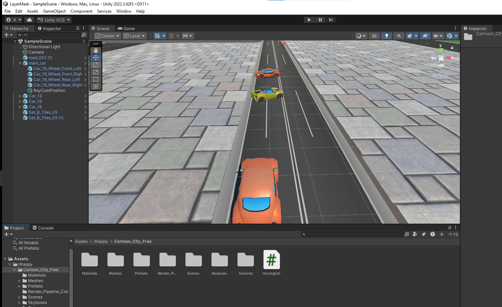
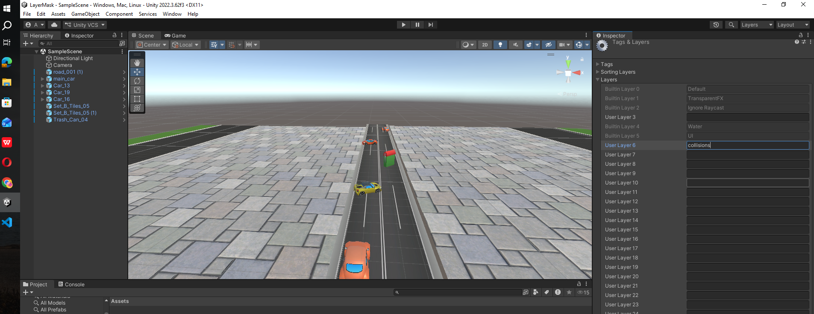
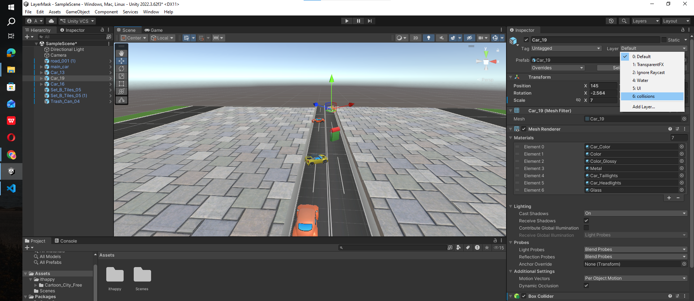
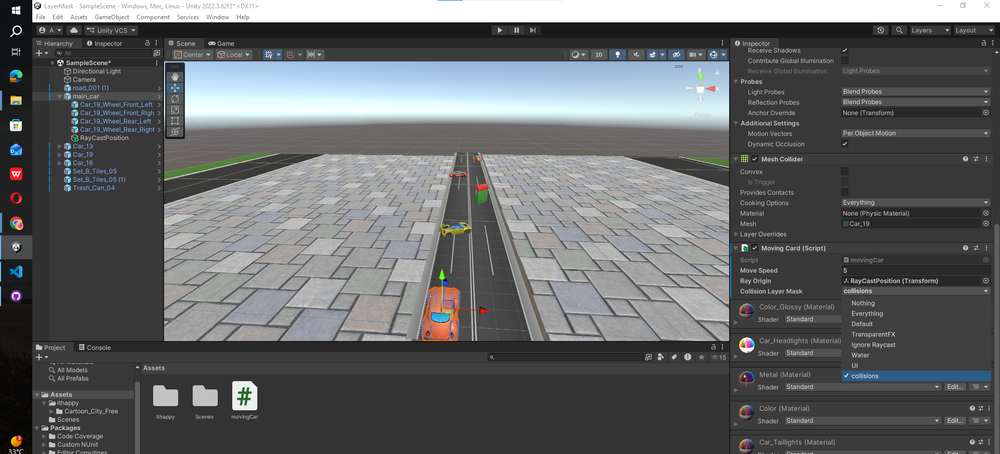

````md
# Car Movement using Raycast

Created a simple lane-switching car movement system using Raycast obstacle detection.

## Scene Setup

- Added Cartoon City free 3D model assets
- If materials appear pink, change shader/material to Standard
- Copied road and tile objects into the scene
- Added 4 cars from the model scene
- Positioned roads, tiles, and obstacle cars properly

## Main Car Setup

- Added `movingCard.cs` script to the main moving car
- Created an Empty GameObject to act as Raycast origin
- Positioned the empty object at the front of the car
- Assigned the empty object to `_rayOrigin` in Inspector

## Obstacle Car Setup

- Added Box Collider components to obstacle cars
- Adjusted collider sizes properly

## Lane Setup

- Identified left lane and right lane X positions
- Assigned lane positions in the script

---

# movingCard.cs

```csharp
using System.Collections;
using System.Collections.Generic;
using UnityEngine;

public class movingCard : MonoBehaviour
{

    [SerializeField] private float _moveSpeed = 5f;
    [SerializeField] private Transform _rayOrigin;
    private float rayDistance = 13f;

    private float _laneChangeSpeed = 5f;
    
    private float _leftLanex = 107.5f;
    private float _rightLanex = 137.3f;
    
    private bool isInLeftLane = true;
    private bool isMovingLanes = false;

    // Update is called once per frame
    void Update()
    {
        transform.Translate(Vector3.forward * _moveSpeed * Time.deltaTime);

        RaycastHit hit;

        Debug.DrawRay(_rayOrigin.position, transform.forward * rayDistance, Color.red);

        if (Physics.Raycast(_rayOrigin.position, transform.forward, out hit, rayDistance))
        {
            //Debug.Log("Found an object named: " + hit.transform.name);
            isMovingLanes = true;
        }

        if (Input.GetKeyDown(KeyCode.Space))
        {
            isMovingLanes = true;
        }

        if (isMovingLanes)
        {
            MoveLane();
        }
    }

    // Move lane
    private void MoveLane()
    {
        if (isInLeftLane)
        {
            transform.Translate(Vector3.right * _laneChangeSpeed * Time.deltaTime);

            //Debug.Log("right");

            Debug.Log(transform.position.x + " > " + _rightLanex + "=" + (transform.position.x > _rightLanex));

            if (transform.position.x > _rightLanex)
            {
                isMovingLanes = false;
                isInLeftLane = false;
            }
        }
        else
        {
            transform.Translate(Vector3.left * _laneChangeSpeed * Time.deltaTime);

            Debug.Log("left");

            if (transform.position.x < _leftLanex)
            {
                isMovingLanes = false;
                isInLeftLane = true;
            }
        }
    }
}
````

---

# movingCard Unity Script Explanation

A simple lane-switching car movement system built in Unity using:

* Continuous forward movement
* Raycast obstacle detection
* Automatic lane switching
* Manual lane switching

---

# Features

* Forward moving vehicle
* Obstacle detection using Raycast
* Automatic lane changing
* Manual lane switching
* Smooth lane movement
* Debug ray visualization

---

# Script Overview

The script performs the following tasks:

1. Moves the car forward continuously
2. Detects obstacles in front using Raycast
3. Switches lanes when an obstacle is detected
4. Allows manual lane switching

---

# Variables

| Variable           | Purpose                         |
| ------------------ | ------------------------------- |
| `_moveSpeed`       | Controls forward speed          |
| `_rayOrigin`       | Starting point of Raycast       |
| `rayDistance`      | Raycast detection distance      |
| `_laneChangeSpeed` | Speed of lane switching         |
| `_leftLanex`       | X position of left lane         |
| `_rightLanex`      | X position of right lane        |
| `isInLeftLane`     | Tracks current lane             |
| `isMovingLanes`    | Checks if lane switch is active |

---

# Forward Movement

```csharp
transform.Translate(Vector3.forward * _moveSpeed * Time.deltaTime);
```

Moves the car forward continuously.

---

# Obstacle Detection

```csharp
Physics.Raycast(_rayOrigin.position, transform.forward, out hit, rayDistance)
```

Detects objects in front of the car.

If an obstacle is detected:

```csharp
isMovingLanes = true;
```

---

# Manual Lane Change

```csharp
if (Input.GetKeyDown(KeyCode.Space))
```

Pressing Space triggers lane switching manually.

---

# Lane Switching

## Left to Right

```csharp
transform.Translate(Vector3.right * _laneChangeSpeed * Time.deltaTime);
```

## Right to Left

```csharp
transform.Translate(Vector3.left * _laneChangeSpeed * Time.deltaTime);
```

---

# Controls

| Key   | Action      |
| ----- | ----------- |
| Space | Change lane |

---

# Unity Setup

## Attach Script

Attach `movingCard.cs` to the car GameObject.

## Create Ray Origin

Create an Empty GameObject:

* Place it in front of the car
* Assign it to `_rayOrigin`

## Add Obstacles

Place obstacle cars in front of the moving car for Raycast detection.

---

# Current Limitations

* Uses old Input System (`Input.GetKeyDown`)
* Hardcoded lane positions
* No obstacle layer filtering
* Possible overshooting during lane switching

---

# Future Improvements

* Convert to new Input System
* Add multiple lanes
* Add smooth interpolation using `Lerp`
* Add obstacle LayerMask
* Add AI traffic system
* Add speed increase over time

---

# Concepts Used

* `Transform.Translate()`
* `Physics.Raycast()`
* `Vector3`
* Boolean state management
* Time-based movement
* Lane switching logic

---

# Debugging

```csharp
Debug.DrawRay(...)
```

Shows Raycast in Scene View using a red line.

---

# Learning Outcome

This project helps understand:

* Basic car movement
* Raycasting in Unity
* Obstacle detection
* Lane switching systems
* Game movement mechanics

#Screenshots





# to add a layerMask on new object trash_can.
update the script
````
    [SerializeField] private LayerMask _collisionLayerMask; //anything that we collide with

    if (Physics.Raycast(_rayOrigin.position, transform.forward, out hit,rayDistance, _collisionLayerMask ))

````
now to add new layer click on main car 
in inspector go to Layer option currently set to default.
click on Add Layer...
add new layer as collisions


now click on the every car the main car will collide with and select layer we created just now.(except the object (trash_can) which we dont want to collide the car with)

for each select => yes, change children
now to the main car in inspector select the field value for Collision Layer Mask as collisions(new layer created)


```
```
